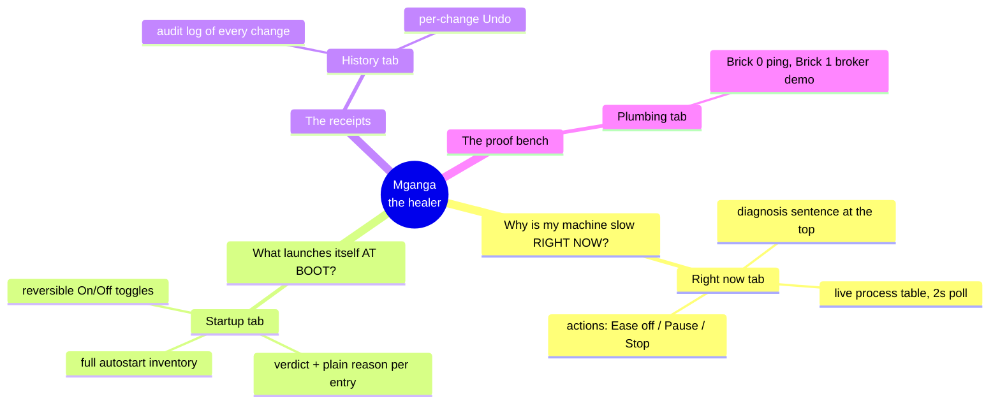
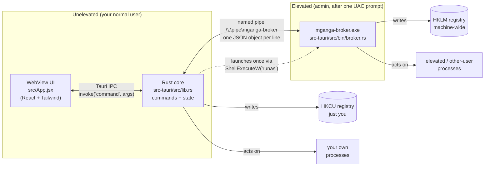
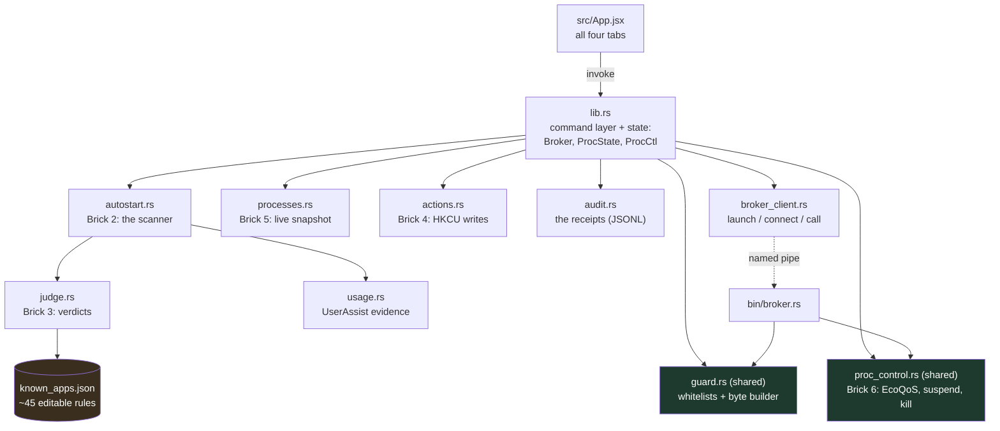
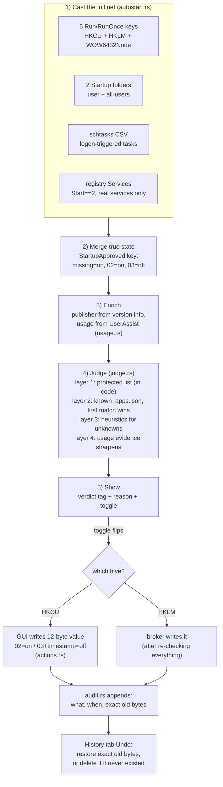
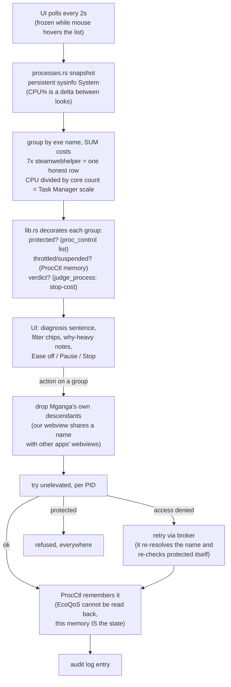
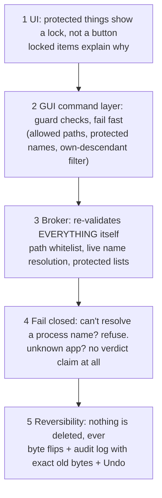

# Mganga — the mind map

How the pieces connect and why. Diagrams are Mermaid; RustRover and GitHub render them
in Markdown preview. For build status see `PROGRESS.md`; for the rules of the project
see `mganga-docs/CLAUDE.md`.

---

## 1. The big picture: one app, two questions

Mganga answers two different questions about the same machine, and every screen belongs
to one of them:

The guiding rule from the docs: **a healer does not poison the patient.** Everything
below exists to make actions safe, reversible, and explained.

---

## 2. Process architecture: who runs with what power

Three processes at runtime. The GUI never has admin rights; one tiny audited binary does.

Key decisions:

- **The broker is the security boundary.** It re-validates every request itself
  (path whitelist, protected lists, name resolution) and never trusts the GUI.
- **Same rules, one source.** `guard.rs` and `proc_control.rs` are compiled into BOTH
  binaries via `#[path]` include, so GUI and broker can never drift apart.
- **Dying politely.** The broker exits on pipe EOF (GUI closed) and also watches the
  GUI's PID as a backup. No orphaned admin processes.

---

## 3. Module map: what depends on what

Green nodes are the **shared safety code** (one source, two binaries). The amber node is
the **editable knowledge**: add an app to `known_apps.json` and both the Startup verdict
and the process verdict learn it, no code changes.

---

## 4. Data flow: the Startup tab (scan → judge → show → act)

The honesty trick: a Run entry existing does not mean it runs. Windows keeps the on/off
state in a separate `StartupApproved` key, and disabling **never deletes** the entry,
only flips the first byte. That is what makes every change reversible.

---

## 5. Data flow: the Right now tab (poll → group → flag → act)

The three actions, in the healer's order:

| Action | Mechanism | What the user is told |
|---|---|---|
| 🍃 Ease off | EcoQoS + idle priority (`SetProcessInformation`) | keeps working, just quietly; reversible |
| ⏸ Pause | `NtSuspendProcess` | frozen where it is; resume continues exactly there |
| Stop | `TerminateProcess`, behind a confirm | unsaved work is lost; gentler options suggested |

---

## 6. The safety stack (why a bug can't hurt the machine)

Defense in depth, shallowest to deepest. Each layer assumes the ones above it failed.

And the named pipe itself is locked to **your user's SID** via an explicit security
descriptor, because a pipe made by an elevated process is not otherwise writable by an
unelevated one (and should not be writable by anyone else at all).

---

## 7. Where knowledge lives (and how to extend it)

| Knowledge | Lives in | Change it by |
|---|---|---|
| App verdicts + reasons (both tabs) | `src-tauri/src/known_apps.json` | editing JSON, no code |
| Protected services (startup) | `judge.rs` `PROTECTED_SERVICES` | code change, deliberately |
| Protected processes (live) | `proc_control.rs` `PROTECTED_PROCESSES` | code change, deliberately |
| Protected autostart names | `guard.rs` patterns | code change, deliberately |
| What Mganga did (throttle/suspend) | `ProcCtl` in lib.rs, in memory | lost on app restart, by design |
| Every change made to the machine | `%LOCALAPPDATA%\Mganga\audit-log.jsonl` | append-only, History tab reads it |
| User's deliberate app launches | Windows' own UserAssist key | read-only evidence |

The split is intentional: **safe-to-edit knowledge is data** (a wrong JSON edit gives a
wrong suggestion), **dangerous knowledge is code** (changing the protected list should
require a rebuild and a diff someone can review).

---

## 8. Runtime lifecycles, in one breath each

- **App start:** window opens unelevated → Right now tab polls → no UAC, no broker yet.
- **First machine-wide action:** broker launched via `runas` (one UAC prompt) → pipe
  connect with retries → stays for the session.
- **App close:** pipe drops → broker reads EOF → exits. Broker also watches the GUI PID
  in case of a crash. Nothing elevated survives the window.
- **Reboot:** disabled autostarters stay disabled (that's the registry byte, persistent);
  throttle/suspend memory resets (those processes restarted anyway).
