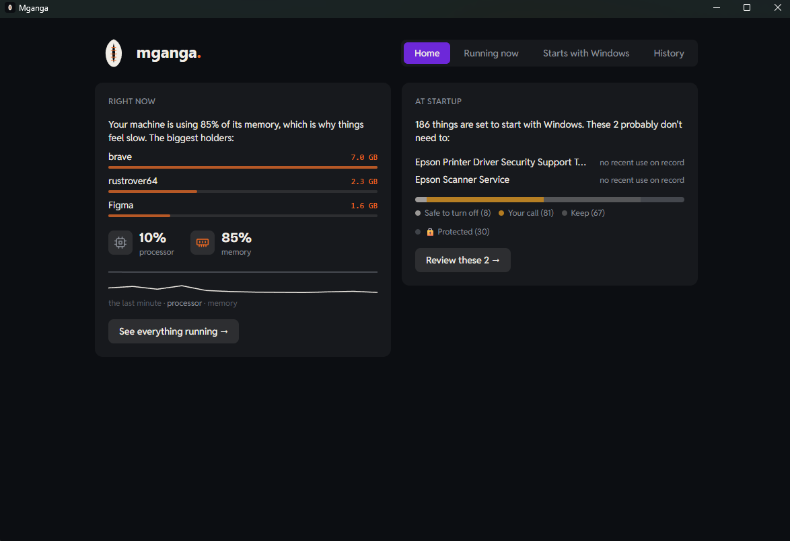

# Mganga

**A Windows resource healer.** Mganga answers two questions in plain language:

1. **Why is my machine slow right now?**
2. **What starts itself with Windows, and does it need to?**

Then it lets you act, gently: ease a busy app into Efficiency mode, pause it, or
turn off an autostart, every change reversible and recorded. *Mganga* is Swahili
for healer, and the rule that follows from the name is the project's first law:
**a healer does not poison the patient.**

> Website: https://seedexr.github.io/mganga/ · Built by [SeedeXR](https://github.com/SeedeXR)



## Why another "PC optimizer"?

Because the category is broken. The typical tool shouts "247 issues found!",
deletes things it cannot restore, and sells fear. Mganga is the opposite by
construction:

- **It shows its evidence.** Every verdict comes with a reason and, where
  Windows records it, real usage history ("you last opened this 3 months ago").
- **Nothing is deleted, ever.** Autostart toggles flip the same bytes Task
  Manager flips. Every change lands in an audit log with one-click undo.
- **Gentle first, violent last.** The first suggestion is always Efficiency
  mode (Windows EcoQoS), then pause, and only after a confirm, stop.
- **Protected means protected.** A built-in list of things that keep Windows
  and your security running is off-limits, enforced in two separate binaries.

## How it works

```
┌─────────────────────────┐        named pipe         ┌──────────────────────┐
│  mganga.exe (unelevated)│ ◄──────────────────────►  │ mganga-broker.exe    │
│  React UI + Tauri v2    │   \\.\pipe\mganga-broker  │ (elevated, on demand)│
│  scans, judges, acts    │                           │ validates every call │
│  on user-level things   │                           │ itself, HKLM writes  │
└─────────────────────────┘                           └──────────────────────┘
```

The app runs without admin rights. Machine-wide changes go through a small
elevated broker, started on demand (one UAC prompt), which re-validates every
request against the same whitelist and protected lists the GUI uses. The safety
code (`guard.rs`, `proc_control.rs`) is compiled into **both** binaries, so a
compromised GUI cannot ask the broker for anything the rules forbid.

Key pieces:

| Piece | Where | What it does |
|---|---|---|
| Autostart scanner | `src-tauri/src/autostart.rs` | 6 Run/RunOnce keys, Startup folders, logon tasks, auto services, StartupApproved state |
| Judgment engine | `src-tauri/src/judge.rs` + `known_apps.json` | verdicts with reasons: safe to turn off / your call / keep / protected |
| Usage evidence | `src-tauri/src/usage.rs` | UserAssist last-opened data backing the verdicts |
| Live processes | `src-tauri/src/processes.rs` | 2s snapshots, grouped per app, Task-Manager-compatible numbers |
| Process control | `src-tauri/src/proc_control.rs` | EcoQoS throttle, suspend/resume, kill, protected list |
| Reversibility | `src-tauri/src/actions.rs` + `audit.rs` | StartupApproved byte flips, JSONL audit log, undo |
| The broker | `src-tauri/src/bin/broker.rs` | elevated helper, named pipe server |
| The UI | `src/App.jsx` | one file: Home, Running now, Starts with Windows, History |

The full design rationale lives in `mganga-docs/` and the build history in
`PROGRESS.md`.

## Build and run

Prerequisites: [Node.js](https://nodejs.org) 20+, [Rust](https://rustup.rs)
stable (MSVC toolchain), Windows 10/11.

```
npm install        # once
npm run tauri dev  # builds the broker, starts Vite, opens the window
```

Production build (installer lands in `target/release/bundle/`):

```
cargo build --release --manifest-path src-tauri/Cargo.toml --bin mganga-broker
npm run tauri build
```

The broker exe must sit next to `mganga.exe`; the CI workflow handles that for
release artifacts (see `.github/workflows/`).

## Tests

```
cargo test -p mganga --lib
```

The tests double as live probes: a registry write/restore roundtrip on a dummy
value, a process-control lifecycle on a self-spawned child process, and a scan
dump written to `target/scan-dump.json` for eyeballing against Task Manager.

## Contributing

Contributions are welcome, from a one-line rule in `known_apps.json` (teach
Mganga about an app, no code required) to new scanners. Start with
[CONTRIBUTING.md](CONTRIBUTING.md), it includes a map of the codebase and the
non-negotiable safety rules.

## Versions pinned for a reason

Vite is pinned to ^6 because the project targets Node 22.0.0, below Vite 7's
floor. Bump Node before bumping Vite.

## License

[GPL-3.0](LICENSE). Mganga will always be open source, and so will every fork
of it. That is deliberate: in a category full of closed-source scareware, the
license is part of the safety model.
